# Slidedeck Refactoring

A pattern collection for refactoring your existing slide decks

_Disclaimer: this content is completely AI-generated and is for demo purposes only._

<!-- START-GENERATED-GRAPH -->

**Pattern Overview and Relationships**

```mermaid
graph TD;
    RefineTitleMessaging["Refine Title Messaging"];
    RefineTitleMessaging --> CondenseSlideContent;
    RefineTitleMessaging --> BuildUpStepbyStep;
    VisualEmphasisFirst["Visual Emphasis First"];
    VisualEmphasisFirst --> CondenseSlideContent;
    VisualEmphasisFirst --> RecolortoSignal;
    RecolortoSignal["Recolor to Signal"];
    RecolortoSignal --> VisualEmphasisFirst;
    RecolortoSignal --> GroupbyMeaning;
    MaintainFontDiscipline["Maintain Font Discipline"];
    MaintainFontDiscipline --> VisualEmphasisFirst;
    MaintainFontDiscipline --> EliminateDeadSpace;
    EliminateDeadSpace["Eliminate Dead Space"];
    EliminateDeadSpace --> GroupbyMeaning;
    EliminateDeadSpace --> VisualEmphasisFirst;
    CondenseSlideContent["Condense Slide Content"];
    CondenseSlideContent --> SplitCompositeSlide;
    CondenseSlideContent --> VisualEmphasisFirst;
    SplitCompositeSlide["Split Composite Slide"];
    SplitCompositeSlide --> CondenseSlideContent;
    SplitCompositeSlide --> BuildUpStepbyStep;
    GroupbyMeaning["Group by Meaning"];
    GroupbyMeaning --> RecolortoSignal;
    GroupbyMeaning --> SplitCompositeSlide;
    CheckSlideDensity["Check Slide Density"];
    CheckSlideDensity --> SplitCompositeSlide;
    CheckSlideDensity --> CondenseSlideContent;
    CheckSlideDensity --> EliminateDeadSpace;
    CombineSlideswithSharedContext["Combine Slides with Shared Context"];
    CombineSlideswithSharedContext --> GroupbyMeaning;
    CombineSlideswithSharedContext --> CheckSlideDensity;
    CombineSlideswithSharedContext --> SplitCompositeSlide;
    StorySpine["Story Spine"];
    StorySpine --> RefineTitleMessaging;
    StorySpine --> BuildUpStepbyStep;
    StorySpine --> VisualEmphasisFirst;
    ReorderSlidesforFlow["Reorder Slides for Flow"];
    ReorderSlidesforFlow --> StorySpine;
    ReorderSlidesforFlow --> BuildUpStepbyStep;
    ReorderSlidesforFlow --> RefineTitleMessaging;
    BuildUpStepbyStep["Build Up Step-by-Step"];
    BuildUpStepbyStep --> SplitCompositeSlide;
    BuildUpStepbyStep --> VisualEmphasisFirst;
    ApplyThemeHarmonization["Apply Theme Harmonization"];
    ApplyThemeHarmonization --> MaintainFontDiscipline;
    ApplyThemeHarmonization --> RecolortoSignal;
    ReframeEndingSlide["Reframe Ending Slide"];
    ReframeEndingSlide --> StorySpine;
    ReframeEndingSlide --> RefineTitleMessaging;
    ReframeEndingSlide --> VisualEmphasisFirst;
    MasterDetailSlide["Master–Detail Slide"];
    MasterDetailSlide --> OneIdeaperSlide;
    MasterDetailSlide --> RefineTitleMessaging;
    MasterDetailSlide --> CollapseSequence;
    OneIdeaperSlide["One Idea per Slide"];
    OneIdeaperSlide --> CondenseSlideContent;
    OneIdeaperSlide --> BuildUpStepbyStep;
    CollapseSequence["Collapse Sequence"];
    CollapseSequence --> GroupbyMeaning;
    CollapseSequence --> VisualEmphasisFirst;
    RefactorTitles["Refactor Titles"];
    RefactorTitles --> CondenseSlideContent;
    RefactorTitles --> BuildUpStepbyStep;
    RefactorVisuals["Refactor Visuals"];
    RefactorVisuals --> VisualEmphasisFirst;
    RefactorVisuals --> RecolortoSignal;
    AlignLayout["Align Layout"];
    AlignLayout --> EliminateDeadSpace;
    AlignLayout --> MaintainFontDiscipline;
    SlideLayoutBalance["Slide Layout Balance"];
    SlideLayoutBalance --> AlignLayout;
    SlideLayoutBalance --> EliminateDeadSpace;
    StructuretheStory["Structure the Story"];
    StructuretheStory --> RefineTitleMessaging;
    StructuretheStory --> BuildUpStepbyStep;
    StructuretheStory --> VisualEmphasisFirst;
    CalltoAction["Call to Action"];
    CalltoAction --> StorySpine;
    CalltoAction --> RefineTitleMessaging;
    CalltoAction --> VisualEmphasisFirst;
    TypographyContrast["Typography Contrast"];
    TypographyContrast --> MaintainFontDiscipline;
    TypographyContrast --> VisualEmphasisFirst;
    MergeContext["Merge Context"];
    MergeContext --> GroupbyMeaning;
    MergeContext --> CombineSlideswithSharedContext;
    ReduceTextDensity["Reduce Text Density"];
    ReduceTextDensity --> SplitCompositeSlide;
    ReduceTextDensity --> VisualEmphasisFirst;
```

<!-- END-GENERATED-GRAPH -->

## Focus Attention

*Helps the audience know what to look at or remember.*

### Refine Title Messaging

#### Intent
Turn slide titles into key takeaways.

#### Problem
Generic titles like “Overview” or “Results” miss the opportunity to communicate insights.

#### Solution
Use declarative, conclusion-oriented titles (e.g., “Revenue Dropped Due to Market Saturation”).

#### Tradeoffs
Pros: Clarity, memorable narrative
Cons: Might oversimplify
Difficulties: Distilling the essence of the slide

#### Rationale
Strong titles help audiences grasp and recall your message quickly.

#### Known Uses
Havard Business Review articles, strategy presentations

#### Related Patterns
Condense Slide Content, Build Up Step-by-Step

#### What Next
Apply Build Up Step-by-Step to let the insight unfold logically.

---

### Visual Emphasis First

#### Intent
Make the most important element visually dominant.

#### Problem
Audiences scan slides quickly. If everything looks the same, nothing stands out.

#### Solution
Use size, contrast, position, or color to emphasize the most critical element on the slide.

#### Tradeoffs
Pros: Highlights what matters
Cons: Risk of overdesign
Difficulties: Balancing contrast and subtlety

#### Rationale
Visual hierarchy guides attention. The brain processes visual cues faster than text.

#### Known Uses
Apple product launch slides, Garr Reynolds' "Presentation Zen" examples

#### Related Patterns
Condense Slide Content, Recolor to Signal

#### What Next
Recolor to Signal to add semantic meaning to your visuals.

---

### Recolor to Signal

#### Intent
Use color intentionally to convey relationships or status.

#### Problem
Default PowerPoint colors often don’t support the narrative or visual hierarchy.

#### Solution
Assign meaning to color: red for risk, green for success, gray for background. Apply it consistently.

#### Tradeoffs
Pros: Reinforces structure and emotion
Cons: May reduce accessibility for color-blind viewers
Difficulties: Needs a clear color legend or convention

#### Rationale
Color can encode structure and emotion if used deliberately.

#### Known Uses
Status dashboards, Agile boards, pitch decks

#### Related Patterns
Visual Emphasis First, Group by Meaning

#### What Next
Group by Meaning to spatially reinforce the same message.

---

### Maintain Font Discipline

#### Intent
Keep typography consistent and clean.

#### Problem
Mixing fonts, sizes, and styles can make slides look chaotic and amateurish.

#### Solution
Use a maximum of 2 font families and consistent sizing hierarchy. Define headline, subhead, and body text sizes and stick to them.

#### Tradeoffs
Pros: Professionalism, easier scanning
Cons: Less visual “fun”
Difficulties: Choosing fonts that work across platforms

#### Rationale
Typography is part of your brand and sets the tone of the presentation.

#### Known Uses
Company brand guidelines, speaker decks

#### Related Patterns
Visual Emphasis First, Eliminate Dead Space

#### What Next
If needed, Apply Theme Harmonization.

---

### Eliminate Dead Space

#### Intent
Use slide real estate efficiently to maintain visual balance.

#### Problem
Slides with large empty areas can appear unfinished or awkward.

#### Solution
Resize and reposition elements to distribute content evenly and with purpose. Don’t just center everything.

#### Tradeoffs
Pros: More polished and intentional slides
Cons: Risk of overcrowding
Difficulties: Requires aesthetic judgment

#### Rationale
Balanced slides appear more professional and intentional.

#### Known Uses
Professional design templates, investor presentations

#### Related Patterns
Group by Meaning, Visual Emphasis First

#### What Next
Refine Title Messaging for maximum impact.

---

## Improve Comprehension

*Makes the message easier to understand and reduces mental effort.*

### Condense Slide Content

#### Intent
Reduce cognitive load and improve focus per slide.

#### Problem
Overly dense slides overwhelm the audience, making key messages hard to grasp. Many slide creators try to be complete rather than impactful.

#### Solution
Summarize, cut redundant bullets, and keep only one message per slide. Use notes or appendices for additional detail.

#### Tradeoffs
Pros: Clarity, stronger message retention
Cons: Might require more slides
Difficulties: Deciding what to omit

#### Rationale
People read slower than you speak. Slides are not documents—they’re visual aids.

#### Known Uses
TED Talks, Steve Jobs' keynotes

#### Related Patterns
Split Composite Slide, Visual Emphasis First

#### What Next
Apply Visual Emphasis First to strengthen your slide’s key point.

---

### Split Composite Slide

#### Intent
Break up multi-topic slides into focused units.

#### Problem
Slides with multiple unrelated bullets/topics create confusion. The audience doesn't know where to focus.

#### Solution
Split each idea or point into its own slide or visual unit. Follow the “one idea per slide” rule.

#### Tradeoffs
Pros: Easier to follow
Cons: More slides
Difficulties: Ensuring logical transitions

#### Rationale
Segmentation improves comprehension and reduces audience fatigue.

#### Known Uses
Consulting slide decks (e.g. McKinsey), modern slide storytelling

#### Related Patterns
Condense Slide Content, Build Up Step-by-Step

#### What Next
Use Build Up Step-by-Step to layer ideas incrementally.

---

### Group by Meaning

#### Intent
Make relationships visible through layout.

#### Problem
Related items are scattered visually, breaking conceptual unity.

#### Solution
Use proximity, alignment, or shapes to group related content spatially.

#### Tradeoffs
Pros: Enhances clarity and flow
Cons: Requires layout effort
Difficulties: Avoiding clutter while grouping

#### Rationale
Gestalt principles of perception (e.g. proximity, similarity) support understanding.

#### Known Uses
Infographics, instructional design, concept maps

#### Related Patterns
Recolor to Signal, Split Composite Slide

#### What Next
Use Eliminate Dead Space to tighten layout.

---

### Check Slide Density

#### Intent
Control the number of visual/textual elements per slide to balance clarity and information.

#### Problem
Even well-aligned slides may be too crowded or too sparse, reducing effectiveness.

#### Solution
Use a rough heuristic: max 6 elements per slide (text boxes, visuals, bullets, etc.). If you have more, consider splitting. If too sparse, consolidate.

#### Tradeoffs
Pros: Improved readability and pacing
Cons: Adds or removes slides
Difficulties: Depends on screen size, context (e.g., large keynote vs. printed handout)

#### Rationale
Cognitive load theory suggests limited items can be processed at once. Excess reduces recall.

#### Known Uses
Corporate slide templates, SlideDocs by Nancy Duarte

#### Related Patterns
Split Composite Slide, Condense Slide Content, Eliminate Dead Space

#### What Next
Apply Build Up Step-by-Step or Combine Slides with Shared Context.

---

### Combine Slides with Shared Context

#### Intent
Reduce slide count and visual fragmentation by grouping closely related content.

#### Problem
Some slides artificially separate details that belong together, breaking comprehension.

#### Solution
Merge slides that share a common context or domain. Use grouping techniques, section headers, or multi-column layouts.

#### Tradeoffs
Pros: Better coherence, shorter decks
Cons: Risk of overloading combined slide
Difficulties: Visual layout challenges

#### Rationale
Context switching impairs understanding. Cohesion improves flow and trust.

#### Known Uses
Educational slide decks, onboarding decks

#### Related Patterns
Group by Meaning, Check Slide Density, Split Composite Slide

#### What Next
Follow with Visual Emphasis First to re-establish focal points.

---

## Reinforce Structure

*Creates a clear flow and mental model of the argument.*

### Story Spine

#### Intent
Create a coherent narrative arc that guides the audience from beginning to end.

#### Problem
Slide decks often lack a sense of progression, making them feel disjointed or tedious. Viewers can't follow the logic or purpose.

#### Solution
Use a narrative structure such as:
*Context → Conflict → Resolution*
or the Pixar-style formula:
“Once upon a time... Every day... Until one day... Because of that... Until finally...”

#### Tradeoffs
Pros: Improved memorability and persuasion
Cons: Might not fit strictly data-driven decks
Difficulties: Requires rethinking the entire deck flow

#### Rationale
Humans are wired to understand stories. Even technical content becomes more engaging when wrapped in a narrative.

#### Known Uses
Keynotes, startup pitch decks, TED Talks

#### Related Patterns
Refine Title Messaging, Build Up Step-by-Step, Visual Emphasis First

#### What Next
Reorder Slides for Flow to align slide structure with the narrative.

---

### Reorder Slides for Flow

#### Intent
Ensure the order of slides follows a logical and emotional arc.

#### Problem
Even well-designed slides can confuse if their sequence feels random or disjointed.

#### Solution
Move slides into a narrative flow. Begin with context, then build tension, introduce the resolution, and end with a call to action or reflection.

#### Tradeoffs
Pros: Increased engagement and clarity
Cons: Harder to maintain if slides are updated separately
Difficulties: Requires global view of the deck structure

#### Rationale
Sequencing influences understanding. Flow enhances the persuasive power of the entire presentation.

#### Known Uses
Executive reports, investor pitches, training decks

#### Related Patterns
Story Spine, Build Up Step-by-Step, Refine Title Messaging

#### What Next
Reframe Ending Slide to conclude with impact.

---

### Build Up Step-by-Step

#### Intent
Guide the audience through your argument incrementally.

#### Problem
Showing everything at once can overwhelm and spoil the flow.

#### Solution
Use slide builds or successive slides to progressively reveal information.

#### Tradeoffs
Pros: Controlled attention, better pacing
Cons: Harder to revise last minute
Difficulties: Overuse can feel gimmicky

#### Rationale
Stepwise revelation maintains curiosity and supports comprehension.

#### Known Uses
Educational talks, storytelling-driven keynotes

#### Related Patterns
Split Composite Slide, Visual Emphasis First

#### What Next
Check for Font Discipline to maintain professional visuals.

---

### Apply Theme Harmonization

#### Intent
Unify look-and-feel across all slides.

#### Problem
Slides created by different people or at different times feel disjointed.

#### Solution
Standardize fonts, colors, backgrounds, icons, and layout. Consider reapplying a consistent master theme or redesigning all slides into a coherent visual identity.

#### Tradeoffs
Pros: Cohesion and brand alignment
Cons: Time-intensive
Difficulties: Legacy formatting issues

#### Rationale
Cohesive design improves perceived quality and professionalism.

#### Known Uses
Corporate branding, pitch decks, conference talks

#### Related Patterns
Maintain Font Discipline, Recolor to Signal

#### What Next
Add a compelling Story Spine for narrative flow.

---

## Enhance Retention

*Leaves a strong final impression or reinforces key points.*

### Reframe Ending Slide

#### Intent
Leave the audience with a clear final message or action.

#### Problem
Many slide decks end with “Thank you” or an empty contact slide—missing the opportunity to drive a conclusion or next step.

#### Solution
Make the last slide a key takeaway, recommendation, or call to action. Optionally, provide a looping visual if used in a booth or unattended setting.

#### Tradeoffs
Pros: Memorable closing, audience clarity
Cons: Needs tailoring to audience and context
Difficulties: Balancing summary vs. call to action

#### Rationale
Recency bias makes the last slide disproportionately influential.

#### Known Uses
Sales decks, advocacy talks, training wrap-ups

#### Related Patterns
Story Spine, Refine Title Messaging, Visual Emphasis First

#### What Next
Back-propagate that message into earlier slides if needed.

---

### Master–Detail Slide

#### Intent

Improve clarity and retention by separating what’s said from what’s saved.

#### Problem

Slides overloaded with both key messages and all related details lead to confusion and fatigue. Audiences struggle to find the main point or remember it.

#### Solution

Introduce each topic with a master slide using short, bold key messages. Follow with one or more detail slides that expand on each point with data, background, or rationale. Present only the master slide; detail slides support review afterward.

#### Tradeoffs

Pros: Improves message clarity and recall
Cons: Adds to slide count
Difficulties: Requires editorial decisions on what’s core vs. context

#### Rationale

Cognitive studies show people retain top-level ideas best when presented alone. This structure aligns with executive reading patterns: message now, backup later.

#### Known Uses

Management reports, consultant decks, decision briefings

#### Related Patterns

One Idea per Slide, Refine Title Messaging, Collapse Sequence

#### What Next

Use Reframe Ending Slide to finish with a summary of master points or a decision prompt.

---

## Other Patterns

### One Idea per Slide

#### Intent

Ensure each slide has a single, clear purpose.

#### Problem

Slides with multiple messages or topics create confusion. The audience doesn't know where to focus.

#### Solution

Split each idea or point into its own slide or visual unit. Follow the “one idea per slide” rule.

#### Tradeoffs

Pros: Easier to follow
Cons: More slides
Difficulties: Ensuring logical transitions

#### Rationale

Segmentation improves comprehension and reduces audience fatigue.

#### Known Uses

Consulting slide decks (e.g. McKinsey), modern slide storytelling

#### Related Patterns

Condense Slide Content, Build Up Step-by-Step

#### What Next

Use Build Up Step-by-Step to layer ideas incrementally.

---

### Collapse Sequence

#### Intent

Merge a series of related slides into a single, well-structured visual.

#### Problem

A long sequence of simple slides can feel slow and disjointed, hiding the big picture.

#### Solution

Consolidate the sequence into one slide using a timeline, flowchart, or grouped layout. Use visual cues to guide the audience through the flow.

#### Tradeoffs

Pros: Shows relationships and context
Cons: Can become visually complex
Difficulties: Requires strong visual design skills

#### Rationale

Seeing the whole system at once can create an “aha” moment and improve understanding of relationships.

#### Known Uses

Process diagrams, historical timelines, system architecture overviews

#### Related Patterns

Group by Meaning, Visual Emphasis First

#### What Next

Apply Visual Emphasis First to highlight the most critical part of the sequence.

---

### Refactor Titles

#### Intent

Turn slide titles into key takeaways.

#### Problem

Generic titles like “Overview” or “Results” miss the opportunity to communicate insights.

#### Solution

Use declarative, conclusion-oriented titles (e.g., “Revenue Dropped Due to Market Saturation”).

#### Tradeoffs

Pros: Clarity, memorable narrative
Cons: Might oversimplify
Difficulties: Distilling the essence of the slide

#### Rationale

Strong titles help audiences grasp and recall your message quickly.

#### Known Uses

Harvard Business Review articles, strategy presentations

#### Related Patterns

Condense Slide Content, Build Up Step-by-Step

#### What Next

Apply Build Up Step-by-Step to let the insight unfold logically.

---

### Refactor Visuals

#### Intent

Replace cluttered or generic visuals with clear, annotated diagrams.

#### Problem

Default charts, busy screenshots, or decorative icons often obscure the message rather than clarifying it.

#### Solution

Re-create or simplify visuals to highlight the key insight. Use labels, callouts, and color to explain what the audience should see.

#### Tradeoffs

Pros: Faster comprehension, more professional look
Cons: Time-consuming
Difficulties: Requires design judgment and tool proficiency

#### Rationale

A well-designed visual can communicate complex information far more efficiently than text.

#### Known Uses

Data journalism (e.g., The New York Times), technical presentations, financial reports

#### Related Patterns

Visual Emphasis First, Recolor to Signal

#### What Next

Use Recolor to Signal to add another layer of meaning.

---

### Align Layout

#### Intent

Create a clean, professional look by aligning all slide elements to a grid.

#### Problem

Misaligned text boxes, images, and charts make slides look messy and unprofessional.

#### Solution

Use alignment tools to ensure all elements are perfectly aligned with each other. Create clear vertical and horizontal lines.

#### Tradeoffs

Pros: Improved readability and aesthetics
Cons: Can feel rigid if overused
Difficulties: Requires attention to detail

#### Rationale

A consistent layout reduces cognitive load and signals professionalism.

#### Known Uses

Corporate templates, graphic design, user interface design

#### Related Patterns

Eliminate Dead Space, Maintain Font Discipline

#### What Next

Use Eliminate Dead Space to optimize the use of space.

---

### Slide Layout Balance

#### Intent

Arrange elements on a slide to create a sense of visual equilibrium.

#### Problem

Slides with poorly distributed elements can feel lopsided or visually jarring, distracting from the message.

#### Solution

Balance the visual weight of text, images, and negative space. Use symmetrical, asymmetrical, or radial balance to create a harmonious composition.

#### Tradeoffs

Pros: Aesthetically pleasing, professional feel
Cons: Can be subjective
Difficulties: Requires a good eye for design

#### Rationale

A balanced layout is more comfortable for the viewer and makes the content easier to absorb.

#### Known Uses

Graphic design, photography, art composition

#### Related Patterns

Align Layout, Eliminate Dead Space

#### What Next

Use Align Layout to ensure all elements are perfectly positioned.

---

### Structure the Story

#### Intent

Create a coherent narrative arc that guides the audience from beginning to end.

#### Problem

Slide decks often lack a sense of progression, making them feel disjointed or tedious. Viewers can't follow the logic or purpose.

#### Solution

Use a narrative structure such as:
*Context → Conflict → Resolution*
or the Pixar-style formula:
“Once upon a time... Every day... Until one day... Because of that... Until finally...”

#### Tradeoffs

Pros: Improved memorability and persuasion
Cons: Might not fit strictly data-driven decks
Difficulties: Requires rethinking the entire deck flow

#### Rationale

Humans are wired to understand stories. Even technical content becomes more engaging when wrapped in a narrative.

#### Known Uses

Keynotes, startup pitch decks, TED Talks

#### Related Patterns

Refine Title Messaging, Build Up Step-by-Step, Visual Emphasis First

#### What Next
Reorder Slides for Flow to align slide structure with the narrative.

---

### Call to Action

#### Intent

Leave the audience with a clear final message or action.

#### Problem

Many slide decks end with “Thank you” or an empty contact slide—missing the opportunity to drive a conclusion or next step.

#### Solution

Make the last slide a key takeaway, recommendation, or call to action. Optionally, provide a looping visual if used in a booth or unattended setting.

#### Tradeoffs

Pros: Memorable closing, audience clarity
Cons: Needs tailoring to audience and context
Difficulties: Balancing summary vs. call to action

#### Rationale

Recency bias makes the last slide disproportionately influential.

#### Known Uses

Sales decks, advocacy talks, training wrap-ups

#### Related Patterns

Story Spine, Refine Title Messaging, Visual Emphasis First

#### What Next
Back-propagate that message into earlier slides if needed.

---

### Typography Contrast

#### Intent

Use font weight, size, and style to create a clear visual hierarchy.

#### Problem

When all text has the same visual weight, it’s hard for the audience to scan and identify the most important information.

#### Solution

Create distinct styles for headlines, subheadings, and body text. Use bolding, italics, or size changes to emphasize key words or phrases.

#### Tradeoffs

Pros: Improved readability and focus
Cons: Overuse can lead to a cluttered look
Difficulties: Requires a good understanding of typography

#### Rationale

Visual hierarchy guides the reader’s eye and helps them process information more efficiently.

#### Known Uses

Web design, print layout, branding guides

#### Related Patterns

Maintain Font Discipline, Visual Emphasis First

#### What Next
Use Maintain Font Discipline to ensure consistency across the deck.

---

### Merge Context

#### Intent

Combine related information from different slides to provide a more holistic view.

#### Problem

Information scattered across multiple slides can make it difficult for the audience to see the connections and understand the bigger picture.

#### Solution

Merge related charts, data points, or ideas onto a single slide. Use visual cues like grouping and labeling to show the relationships.

#### Tradeoffs

Pros: Improved understanding of context and relationships
Cons: Can create a dense slide if not managed well
Difficulties: Requires careful visual organization

#### Rationale

Seeing related information together reduces cognitive load and helps the audience synthesize information.

#### Known Uses

Dashboards, comparison slides, executive summaries

#### Related Patterns

Group by Meaning, Combine Slides with Shared Context

#### What Next
Use Group by Meaning to further clarify the relationships between elements.

---

### Reduce Text Density

#### Intent
Reduce cognitive load and improve focus per slide.

#### Problem
Overly dense slides overwhelm the audience, making key messages hard to grasp. Many slide creators try to be complete rather than impactful.

#### Solution
Summarize, cut redundant bullets, and keep only one message per slide. Use notes or appendices for additional detail.

#### Tradeoffs
Pros: Clarity, stronger message retention
Cons: Might require more slides
Difficulties: Deciding what to omit

#### Rationale
People read slower than you speak. Slides are not documents—they’re visual aids.

#### Known Uses
TED Talks, Steve Jobs' keynotes

#### Related Patterns
Split Composite Slide, Visual Emphasis First

#### What Next
Apply Visual Emphasis First to strengthen your slide’s key point.